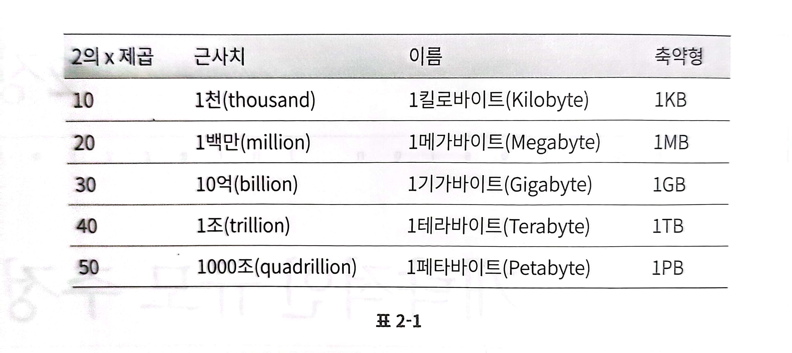
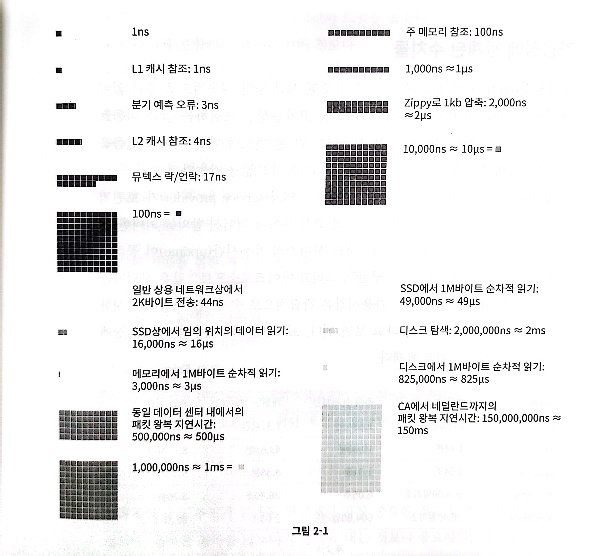
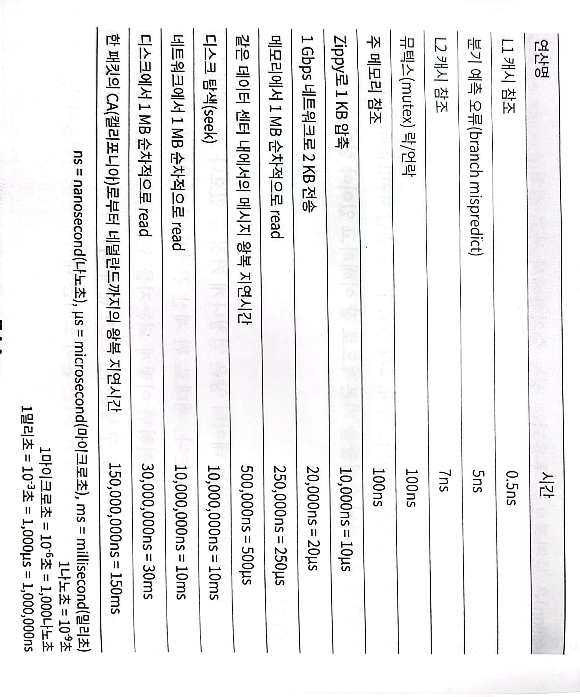
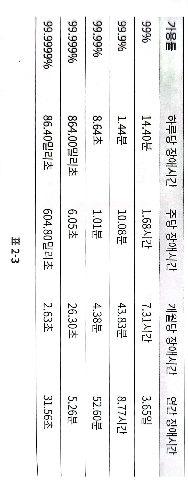

# 02. 개략적인 규모 추정

- 보편적으로 통용되는 성능 수치상에서 사고 실험을 행하여 추정치를 계산하는 행위
- 어떤 서례가 요구사항에 부합할 것인지 보기 위한 것

## 📒 2의 제곱수
- 최소 단위 1byte = 8bit (1 ASCII = 1 bit)

&nbsp;

## 📒 모든 프로그래머가 알아야 하는 응답 지연 값
- 메모리는 빠르지만, 디스크는 아직도 느리다
- 디스크 탐색은 가능한 한 피하라
- 단순한 압축 알고리즘은 빠르다
- 데이터를 인터넷으로 전송하기 전에 가능하면 압축하라
- 데이터 센터는 보통 여러 지역에 분산되어 있고, 센터들 간에 데이터를 주고받는 데는 시간이 걸린다.

&nbsp;

## 📒 가용성에 관계된 수치들
- 고가용성: 시스템이 오랜 시간 동안 지속적으로 중단 없이 운영될 수 있는 능력
- SLA (Service Level Agent): 서비스 사업자와 고객 사이에 맺어진 합의 (서비스의 가용시간uptime 포함)
- MS, Amazon, Google은 99% 이상의 SLA 제공

&nbsp;

## 📒 트위터 QPS와 저장소 요구량 추정
### 가정
- MAU: 3억 명
- 50% 사용자가 트위터를 매일 사용한다
- 평균적으로 각 사용자는 매일 2건의 트윗을 올린다
- 미디어를 포함하는 트윗은 10% 정도
- 데이터는 5년간 보관

### 추정
**[QPS query per second 추정치]**
- DAU: 3억 * 50% = 1.5억
- QPS: 1.5억 * 2트윗/24시간/3600초 = 약 3500
- 최대 QPS peek qps: 2 * QPS = 약 7000

**[미디어 저장을 위한 저장소 요구량]**
- 평균 트윗 크기
    - tweet_id: 64 byte
    - text: 140 byte
    - media: 1MB
- 미디어 저장소 요구량: 1.5억 * 2 * 10% * 1MB = 30TB/일
- 5년간 미디어를 보관하기 위한 저장소 요구량: 30TB * 365 * 5 = 약 55PB

## ❓ 많이 출제되는 개략적 규모 추정 문제
- QPS
- 최대 QPS
- 저장소 요구량
- 캐시 요구량
- 서버 수